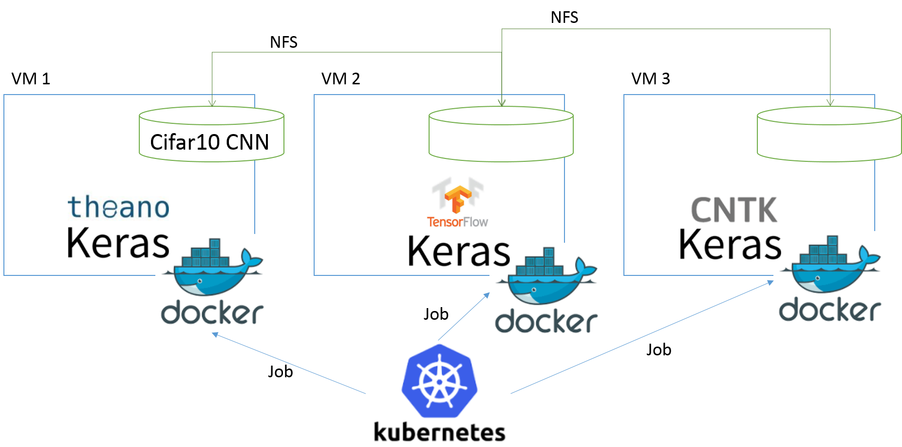
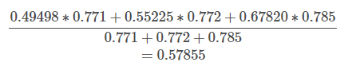

# keras_multibackend
This project aims to run ensemble model using Keras.
Keras is a high-level wrapper library for Tensorflow, Theano and CNTK to run deep learning training and inference.
One of its advantages is that you can write the same deep learning program and execute with different backend whichever you choose.
This repository provides running Cifar10 CNN on each backend parallelly, on Docker powered by Kubernetes, to implement ensemble training and inference.

## Architecture
This is the architecture for parallel ensemble training and inference of Keras on Kuberenetes.

I have three virtual machines on AWS, with one Kubernetes master and three minions, with master being one of it, connected to NFS to share data.
The Kubernetes runs training and inference written with Python3 and Keras as a Kubernetes Job, allowing parallelly running them on three minions, with different backend for Keras. The [Docker image](./dockerfile) for each backend are all the same one, with the backend is controlled over environment variable.

## Setup
1. Install NFS server and client on each virtual machine, sharing /tmp/nfstest/.
2. Install Docker and Kubernetes.
3. Set Kubernetes network, master, minion, and NFS
4. Upload files in the Github to NGS /tmp/nfstest/.
5. Build Docker image as jupyter:1.52.
6. Run training on each backend as Kubernetes Job: , , .
7. Once you get the training done, run prediction as Kubernetes Job: 

## Results
This is the training accuracy and loss for each backend.

|  Backend |           Accuracy  |         Loss |
|-----------|------------|------------|
|Theano    |    0.785    |        0.62  |
|TensorFlow |   0.772     |        0.63  |
|CNTK        |  0.771      |       0.67  |

A sample inferences of each backend, with ensemble prediction is below.
On image no.1, CNTK is predicting 4 with 49.498%, while Tensorflow and Theano 3 with 55.225% and 67.820% respectively.
Getting weighted average according to the training accuracy with each inference, calculated as below, the ensemble inference is 3 with 57.855%.
It is interesting that in some cases, even though all three inferences are wrong, while ensemble inference becomes right after weighted average .

|data |backends| 0 | 1 | 2 | 3 | 4 | 5 | 6 | 7 | 8 | 9 |
|-----------|------------|------------|------------|------------|------------|------------|------------|------------|------------|------------|------------|
|1|cntk | 0.039% | 0.053% | 2.518% | 11.623% | 49.498% | 6.068% | 4.404% | 2.736% | 0.075% | 0.108% |
| |tensorflow | 0.049% | 0.002% | 0.289% | 55.225% | 0.055% | 20.520% | 0.399% | 0.143% | 0.495% | 0.015% |
| |theano | 0.002% | 0.005% | 0.028% | 67.820% | 0.068% | 3.543% | 6.598% | 0.017% | 0.027% | 0.347% |                  
|answer:3 |ensemble|0.039% | 0.026% | 1.218% | 57.855% | 21.318% | 12.945% | 4.898% | 1.244% | 0.257% | 0.202%
|2|cntk | 19.015% | 6.447% | 0.027% | 0.125% | 0.007% | 0.001% | 0.001% | 0.004% | 51.443% | 0.052% |
| |tensorflow | 0.000% | 0.019% | 0.000% | 0.000% | 0.000% | 0.000% | 0.000% | 0.000% | 77.173% | 0.000% |
| |theano | 0.045% | 2.147% | 0.000% | 0.000% | 0.000% | 0.000% | 0.000% | 0.000% | 76.233% | 0.030% |                  
|answer:8 |ensemble|8.188% | 3.700% | 0.012% | 0.053% | 0.003% | 0.000% | 0.000% | 0.002% | 88.006% | 0.035%
|3|cntk | 41.421% | 2.234% | 0.902% | 0.223% | 1.573% | 0.006% | 0.062% | 0.070% | 21.528% | 9.104% |
| |tensorflow | 1.056% | 3.040% | 0.000% | 0.028% | 0.000% | 0.000% | 0.002% | 0.000% | 72.917% | 0.147% |
| |theano | 0.356% | 52.288% | 0.012% | 0.305% | 0.005% | 0.000% | 0.001% | 0.001% | 23.977% | 1.508% |                  
|answer:8 |ensemble|18.402% | 24.729% | 0.393% | 0.239% | 0.678% | 0.003% | 0.028% | 0.031% | 50.876% | 4.622%
|4|cntk | 44.158% | 6.019% | 1.613% | 4.033% | 1.339% | 0.091% | 0.133% | 0.150% | 11.250% | 8.334% |
| |tensorflow | 68.420% | 0.740% | 0.175% | 0.296% | 0.010% | 0.004% | 0.029% | 0.006% | 6.932% | 0.580% |
| |theano | 37.302% | 2.057% | 0.594% | 2.029% | 0.348% | 0.086% | 0.043% | 0.029% | 33.511% | 2.455% |                  
|answer:0 |ensemble|64.391% | 3.788% | 1.023% | 2.731% | 0.729% | 0.078% | 0.088% | 0.079% | 22.208% | 4.884%
|5|cntk | 0.005% | 0.001% | 27.413% | 1.284% | 8.657% | 0.023% | 39.720% | 0.001% | 0.017% | 0.001% |
| |tensorflow | 0.000% | 0.000% | 0.020% | 0.884% | 71.491% | 0.001% | 4.796% | 0.000% | 0.000% | 0.000% |
| |theano | 0.000% | 0.000% | 2.550% | 0.190% | 1.722% | 0.000% | 73.993% | 0.000% | 0.000% | 0.000% |                  
|answer:6 |ensemble|0.002% | 0.000% | 12.881% | 1.013% | 35.172% | 0.011% | 50.913% | 0.000% | 0.007% | 0.000%
|6|cntk | 0.001% | 0.000% | 3.774% | 23.424% | 8.258% | 0.708% | 40.913% | 0.036% | 0.001% | 0.005% |
| |tensorflow | 0.002% | 0.000% | 0.401% | 41.210% | 1.115% | 4.864% | 29.589% | 0.006% | 0.004% | 0.001% |
| |theano | 0.000% | 0.000% | 0.009% | 0.263% | 0.005% | 0.072% | 78.107% | 0.000% | 0.000% | 0.000% |                  
|answer:6 |ensemble|0.001% | 0.000% | 1.797% | 27.881% | 4.029% | 2.425% | 63.844% | 0.018% | 0.002% | 0.003%
|7|cntk | 3.350% | 0.113% | 14.258% | 12.193% | 0.190% | 4.802% | 0.295% | 41.802% | 0.021% | 0.097% |
| |tensorflow | 0.048% | 41.460% | 0.462% | 9.073% | 0.000% | 0.737% | 0.079% | 0.602% | 0.044% | 24.686% |
| |theano | 0.008% | 49.193% | 0.053% | 2.381% | 0.001% | 0.065% | 0.183% | 0.015% | 0.024% | 26.531% |                  
|answer:1 |ensemble|1.463% | 38.994% | 6.347% | 10.159% | 0.082% | 2.408% | 0.240% | 18.224% | 0.038% | 22.045%
|8|cntk | 0.014% | 0.001% | 14.742% | 5.123% | 42.021% | 0.048% | 15.141% | 0.020% | 0.008% | 0.004% |
| |tensorflow | 0.108% | 0.000% | 9.300% | 6.686% | 31.076% | 0.310% | 29.625% | 0.072% | 0.008% | 0.007% |
| |theano | 0.023% | 0.000% | 33.777% | 0.185% | 1.431% | 0.096% | 42.927% | 0.013% | 0.002% | 0.000% |                  
|answer:6 |ensemble|0.062% | 0.000% | 24.840% | 5.153% | 32.018% | 0.195% | 37.674% | 0.046% | 0.007% | 0.005%
|9|cntk | 0.005% | 0.000% | 4.104% | 43.597% | 17.353% | 5.953% | 5.485% | 0.624% | 0.000% | 0.001% |
| |tensorflow | 0.000% | 0.000% | 0.067% | 70.856% | 2.242% | 3.932% | 0.091% | 0.004% | 0.000% | 0.000% |
| |theano | 0.000% | 0.000% | 0.001% | 78.418% | 0.011% | 0.021% | 0.002% | 0.003% | 0.000% | 0.000% |                  
|answer:3 |ensemble|0.002% | 0.000% | 1.792% | 82.860% | 8.423% | 4.256% | 2.396% | 0.271% | 0.000% | 0.000%
|10|cntk | 8.810% | 7.715% | 8.225% | 13.706% | 6.575% | 3.413% | 8.631% | 4.522% | 5.751% | 9.773% |
| |tensorflow | 0.482% | 68.974% | 0.012% | 0.014% | 0.001% | 0.001% | 0.213% | 0.000% | 4.088% | 3.405% |
| |theano | 0.480% | 48.363% | 0.000% | 0.000% | 0.000% | 0.000% | 0.000% | 0.000% | 3.134% | 26.477% |
|answer:1 |ensemble|4.199% | 53.724% | 3.539% | 5.895% | 2.825% | 1.467% | 3.799% | 1.943% | 5.574% | 17.036%

